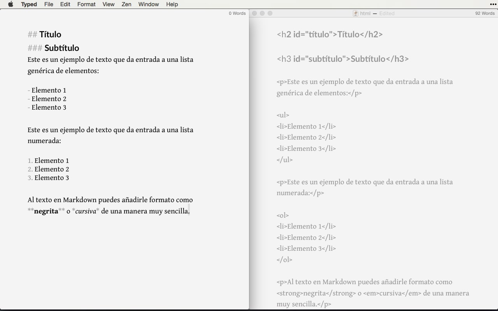

# Qué es Markdown

Markdown nació como una herramienta de conversión de texto plano a HTML. Fue creada en 2004 por John Gruber y se distribuye de manera gratuita bajo una licencia BSD.

Aunque en realidad, Markdown también se considera un lenguaje cuyo objetivo es permitir la creación de contenido de forma sencilla, manteniendo un diseño legible. Por lo tanto, se puede simplificar definiendo Markdown como un **método de escritura**.

De cara al usuario final, no hay ninguna diferencia perceptible. Por ejemplo, este artículo acerca de cómo funciona Markdown está escrito en este formato, y, sin embargo, lo ves perfectamente formateado.

Este método permite añadir formatos como **negritas**, *cursivas* o enlaces, utilizando simplemente texto plano, lo que hace que la escritura sea más simple y eficiente al evitar distracciones.

---

## Diferencia entre Markdown y HTML

Observa la diferencia entre la sintaxis Markdown (izquierda) y la sintaxis HTML (derecha). ¿Con cuál te quedas? 

<figure markdown="span">
  
</figure>

Para lograrlo, necesitarás conocer la sintaxis Markdown.

---

## ¿Para qué sirve Markdown?

Markdown es ideal para quienes publican contenido de manera constante en Internet, donde el lenguaje HTML está ampliamente presente en plataformas como WordPress, Squarespace o Jekyll. 

Sin embargo, no se limita a blogs o páginas web. Servicios como **Trello** o foros como **Stack Overflow** también soportan este lenguaje. Además, con el tiempo encontrarás aún más lugares que lo utilizan.

Incluso en el mundo “offline”, Markdown está cada vez más extendido. Puedes usarlo para tomar notas y apuntes en clases o reuniones, utilizando aplicaciones específicas. También podrías escribir un libro, ya que puedes exportar el contenido final fácilmente a formatos como **ePub**.

Muchas publicaciones en Amazon, Google Play o iBooks han sido creadas gracias a Markdown y herramientas como **Ulysses** (para Mac y iOS). Gracias a la simplicidad de su sintaxis, es ideal para escribir y dar formato rápidamente, especialmente desde dispositivos móviles.

---

## ¿Por qué utilizar Markdown?

Markdown es un lenguaje de marcado basado en un formato de texto plano. Este tipo de formato es **compatible con todas las plataformas**, lo que garantiza que tu contenido será accesible desde cualquier dispositivo: smartphones, ordenadores de escritorio, tablets, etc. En cualquiera de ellos encontrarás aplicaciones adecuadas para leer y editar este tipo de contenido.

Por ejemplo, observa la diferencia entre un archivo creado con un procesador de textos (como Word) y el mismo archivo abierto con un editor de texto plano:

- **Texto en un procesador como Word**: Todo parece muy sencillo y visual.
- **Texto en un editor de texto plano**: Totalmente limpio y legible, aunque menos atractivo visualmente.

Si en el futuro herramientas como Microsoft Word desapareciesen, podrías perder acceso a todo el contenido creado durante años. Para evitar esto, lo más inteligente es generar tu contenido de manera sencilla: utilizando texto plano.

El único inconveniente del texto plano es que no permite aplicar formato (negritas, cursivas, enlaces, etc.), a menos que utilices **Markdown**.