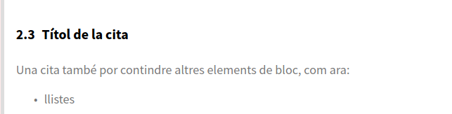

# Sintaxis básica

Como hemos dicho, Markdown se basa en ficheros de tipos texto, que no contienen ninguna información interna sobre el formato. Esta información, se especificará de forma explícita mediante hashtags, que serán visibles en todo momento, y que facilitarán, por un lado su interpretación en la hora de exportarlos a otro formato, pero también su lectura por parte de las personas.

En aquet apartado, el central del tema, vamos a ver cuáles son los diferentes elementos que podemos utilizar en un texto en formato Markdown, así como las principales marcas de formato.

## Párrafos

Un párrafo, tal y como lo entiende Markdown, es un bloque de texto definido entre **dos saltos de línea** (tecla `Intro/Entero/Entrar`). 

Si utilizamos solo un salto de línea, se sobreentiende que es el mismo párrafo, y en la hora de generar el documento, lo veremos como tal.

Si el que deseamos, por otro lado es añadir solo un salto de línea en mitad de un párrafo, añadiremos al menos dos espacios al final de la línea, y uno sí que utilitzrem uno (solo un) salto de línea.

Vemos-lo con algún ejemplo:

```markdown linenums="1" title="Markdown"
Este es el primer párrafo, como veis, necesita dos saltos de línea, o el que sería el mismo, una línea en blanco después del párrafo.

Este es otro paràgrar,   
en el que hemos forzado saltos de línea,    
y aunque no se vea, estas líneas  
acaban con dos o más espacios en blanco.
```    

## Cabeceras

Hay varias formas de marcar cabeceras:

* Utilizando al menos un símbolo `=`o `-` después del texto para indicar cabeceras de primero y segundo nivel:

```markdown linenums="1" title="Markdown"
Esto sería una cabecera de primer nivel
========================================

Esto sería una cabecera de segundo nivel
---------------------------------------

Recordáis que solo hace falta uno = o uno -, aunque se  pueden utilizar más, como es el caso de este ejemplo, donde se han utilizado tantos símbolos como longitud tiene el título.
```

* Utilizando el *Estilo ATX**, al cual, utilizamos el símbolo `#` antes del texto para indicar el nivel de la cabecera. Se admiten hasta seis niveles de profundidad (`######`), el que vendría a ser del `h1` hasta el `h6` de #HTML.

```markdown linenums="1" title="Markdown"

# Cabecera de primer nivel

## Cabecera de segundo nivel nivel

### Cabecera de tercer nivel nivel

...

###### Cabecera de nivel 6
```

>
> *A tener con cuenta*
>
> La versión estándar de Markdown no requiere de una línea en blanco antes de una cabecera, pero otras versiones, como por ejemplo la de *Pandoc* sí que la requiere. Sin embargo, aunque el estándar no lo utilizo, conviene añadirla puesto que facilita así la lectura y localización de estas.
>
> Algunas implementaciones, tampoco requieren de un espacio entre el símbolo `#` inicial y el primer carácter del título. *Pandoc* sí que pide este espacio, de forma que podemos posar un `#hastah` a primeros de un párrafo sin que lo interprete como una cabecera.
>

### Atributos a la cabecera

Cuando se genera un documento, ya sea PDF, #HTML u otro formato a partir de un documento en Markdown, a las cabeceras se los asigna un identificador de manera automática, para que se pueda hacer referencia a ellas desde otras partes del documento. Este identificador se obtiene a partir del texto de la cabecera, por el que si esta es larga, el identificador también lo será. La versión de Pandoc, nos permite añadir ciertos atributos a las cabeceras, entre las que se encuentra el identificador. 

Vemos-lo con un ejemplo. Dada, por ejemplo la primera cabecera de este documento:

```markdown linenums="1" title="Markdown"
# Introducción: El arte de escribir ante un ordenador
```

El identificador que se genera es: `id="introducción-lart-describir-ante-un-ordenador"`. 

Esta cabecera, la podriem haber escrito también de la siguiente forma:

```markdown linenums="1" title="Markdown"
# Introducción: El arte de escribir ante un ordenador { #introduccio }
```

Siente el identificador de la cabecera solo `#introduccio`, de forma que podemos hacer referencia al apartado mediante este.

## Formatación de texto

Markdown nos permite hacer uso del símbolo del asterisco como marca de formato para indicar textos tanto en cursiva, como en negrita o ambos. Para lo cual haremos uso de ún, dos o tres asteriscos al principio y al final del texto que queremos remarcar. Además, hay que tener en cuenta que no tenemos que añadir ningún espacio entre los asteriscos del principio y la primera palabra y los asteriscos del final y la última.

Vemos-lo con ejemplos:

```markdown linenums="1" title="Markdown"
Con un asterisco marcamos un texto en cursiva
Con dos asteriscos marcamos un *texto en negrita** 
Con tres asteriscos marqiem un **texto en cursiva y negrita**

En cambio, si añadimos algún espacio entre medio, ** no se interpretará correctamente*
```

Con un asterisco marcamos un texto en cursiva*  
Con dos asteriscos marcamos un *texto en negrita**   
Con tres asteriscos marqiem un **texto en cursiva y negrita**

En cambio, si añadimos algún espacio entre medio, ** no se interpretará correctamente*

!!! note "Resultado"
    Con un asterisco marcamos un texto en cursiva*  
    Con dos asteriscos marcamos un *texto en negrita**   
    Con tres asteriscos marqiem un **texto en cursiva y negrita**

    En cambio, si añadimos algún espacio entre medio, ** no se interpretará correctamente*


## Líneas horizontales

Una línea horizontal se define mediante tres o más símbolos ``, `-` o `_`, separados o no por espacios:

```markdown linenums="1" title="Markdown"
- - -

* * 

_ _ _
```

Resultado:

- - -

* * 

_ _ _


## Listas

Markdown permite hacer uso tanto de listas ordenadas como listas no ordenadas.

#### Listas no ordenadas

Las listas no ordenadas se marcan haciendo uso de los símbolos ``, `+` o `-` a primeros de cada elemento, e incluyendo cada ítem en una línea diferente (y no hacen falta dos saltos de línea).

```markdown linenums="1" title="Markdown"
* Elemento 1
* Elemento 2
...
```

Cada elemento de la lista puede contener varios párrafos, y otros contenidos a nivel de bloque. Cuando queremos incluir varios párrafos en un ítem de la lista, el segundo párrafo y posteriora tendrán que ir *precedidos por una línea en blanco, y sangrados por aliniar-se con el contenido que no sea el espacio después del marcador de la lista**.

Por ejemplo:

```
* Primer elemento de la lista
* Segundo elemento de la lista

  Otro párrafo correspondiente al segundo elemento de la lista.
  No hace falta un espacio en blanco entre el último párrafo y el siguiente elemento,
  pero lo podemos añadir para facilitar la lectura de la lista.

* Tercer elemento de la lista.
```

Una lista puede contener dentro de otras listas. En este caso, podamos o no incluir una línea en blanco delante. Para utilizar una lista dentro de otra solo tendremos que sangrar* la lista que está dentro de la otra por aliniar-la con el primer carácter de texto del elemento que la contiene. Podemos tener tantas listas dentro de otras como volguem.

```markdown linenums="1" title="Markdown"
* Elemento 1
  * subelemento 1.1
    * subelemento 1.1.1
    * subelemento 1.1.2
  * subelemento 1.2
  * subelemento 1.3
* Elemento 2
```

En estos casos, como que podemos utilizar varios símbolos para indicar listas, se suele utilizar un elemento por cada nivel de la lista, con el fin de facilitar la lectura del texto plano:

```markdown linenums="1" title="Markdown"
* Elemento 1
  + subelemento 1.1
    - subelemento 1.1.1
    - subelemento 1.1.2
  + subelemento 1.2
  + subelemento 1.3
* Elemento 2
```

Resultado:

* Elemento 1
  + subelemento 1.1
    - subelemento 1.1.1
    - subelemento 1.1.2
  + subelemento 1.2
  + subelemento 1.3
* Elemento 2

#### Listas ordenadas

El funcionamiento de las listas ordenadas es el mismo que las no ordenadas, salvo que cada elemento de la lista lleva un número en lugar de una viñeta*.

En la versión estándar de Markdown los elementos que indican la orden tienen que ser *números decimales seguidos de un punto y un espacio**. En el estándar, *estos números se ignoran**, por el que la lista:

```markdown linenums="1" title="Markdown"
1. Elemento 1
2. Elemento 2
3. Elemento 3
```

Será la misma que:

```markdown linenums="1" title="Markdown"
4. Elemento 1
5. Elemento 2
6. Elemento 3
```

El Markdown de Pandoc, añade un par de extensiones a esta forma de utilizar las listas ordenadas.

En primer lugar, además de números, permite marcar los elementos de una lista ordenada con letras mayúsculas, minúsculas o números romanos. Para lo cual utilizaremos como marcadores de lista la letra entre paréntesis o bien solo con el paréntesis derecho, seguido de al menos un espacio. También podemos utilizar el punto, pero en este caso, añadiendo dos espacios como mínimo detrás el punto en lugar de uno.

Por ejemplo:

```markdown linenums="1" title="Markdown"
(A) Elemento 1
(B) Elemento 2

A) Elemento 1
B) Elemento 2

I.  Elemento 1, con dos espacios mínimos después del punto
II.  Elemento 2, con dos espacios mínimos después del punto
```

Por otro lado, con Pandoc también podemutilitzar el símbolo `#` como marcador de lista ordenada, de forma que el sistema poso automáticamente la numeración. Así el código:

```markdown linenums="1" title="Markdown"
#. elemento 1
#. elemento 2
```

Generaría la lista:

```markdown linenums="1" title="Markdown"
1. elemento 1
2. elemento 2
```

Otra extensión del Markdown de Pandoc respecto al Markdown original es que conserva la numeración a partir del número inicial. Por ejemplo, si indicamos por error:

```markdown linenums="1" title="Markdown"
5. Elemento 5
7. Elemento 6
8. Elemento 7
```

La salida será la siguiente, donde se corrige este error en la numeración.

```markdown linenums="1" title="Markdown"
5. Elemento 5
6. Elemento 6
7. Elemento 7
```

#### Listas de tareas

Una extensión más que añade la versión de Pandoc al estándar es la posibilidad de utilizar listas de tareas, introducidas al Markdown de Github.

Para utilizar este tipo de listas utilizamos el guion como marcador de lista seguido de un espacio y las secuencias de caracteres `[ ]`y `[x]` para indicar un elemento de lista no marcado y marcado respectivamente. Por ejemplo:


```markdown linenums="1" title="Markdown"
- [ ] Elemento de lista como tarea sin marcar
- [x] Elemento de lista como tarea marcada.
```

Obtindría como resultado:

- [ ] Elemento de lista como tarea sin marcar
- [x] Elemento de lista como tarea marcada.

## Tablas

Las tablas nos sirven para presentar información de manera organizada.

La versión original de Markdown de John Gruber no incluye la definición de tablas en la sintaxis de Markdown. Como que inicialmente se va concebir como una herramienta para hacer la conversión a #HTML, para añadir tablas se utilizaba directamente este lenguaje.

Sin embargo, las diferentes variantes de Markdown han ido añadiendo notaciones y extensiones al Markdown original para soportar tablas.

La sintaxis para crear tablas del Markdown de Github es una de los más tendidos, y hace uso de barras verticales (`|`) y guiones (`-`) para crearlas. Los guiones se utilizan por creado el encabezamiento de cada columna, y las barras verticales sirven de separador de cada columna. Además, para que la tabla se represente correctamente, hace falta una línea en blanco antes de la tabla.

Las tablas, en este formato tienen que tener necesariamente una cabecera y un cuerpo, y seguirán la siguiente sintaxis:

```markdown linenums="1" title="Markdown"
| Cabecera 1 | Cabecera 2 |
|-------------|-------------|
| Valor 1     | Valor 2     |
| Valor 3     | Valor 4     |
```
Que tiene como resultado:

 Cabecera 1 | Cabecera 2 
-------------|-------------
 Valor 1     | Valor 2     
 Valor 3     | Valor 4    

  

Algunas consideraciones:

* Podemos añadir tantos campos (columnas) como queramos. 
* La línea que separa la cabecera del cuerpo `|---|---|` es obligatoria, pero no es necesario que tenga tantos caracteres como tengan las cabeceras, por el que no hace falta que la tabla esté completamente aliniada. 
* Las barras verticales (`|`) del principio y del final son opcionales.

#### Formateado el contenido de una tabla

Dentro de una tabla podemos utilizar también ciertas marcas de formato, como negritas, cursivas, enlaces, imágenes...

Además, podemos aliniar el texto a la izquierda, a la derecha o en el centro de la columna, añadiendo la marca dos puntos `:`, al lado izquierda, derecho, o a los dos, de los guiones del encabezamiento.

Vemos-lo con un ejemplo. La siguiente definición de tabla:

```markdown linenums="1" title="Markdown"
| Texto a la izquierda | Texto centrado | Texto a la derecha |
|        :---       |     :---:    |      ---:       |
| xxx               | xxx          | xxx             |
| xxxxx             | xxxxx        | xxxxx           |
```

Tiene el siguiente resultado:

| Texto a la izquierda | Texto centrado | Texto a la derecha |
|        :---       |     :---:    |      ---:       |
| xxx               | xxx          | xxx             |
| xxxxx             | xxxxx        | xxxxx           |

>
> Si el que volamos es añadido dentro de una tabla una barra vertical como contenido, tenemos que posar antes el símbolo `\`, para indicar que el carácter siguiente no se tiene que interpretar como marca de formato Markdown. Esta barra invertida se denomina carácter de escape*, y a la combinación de ella con cualquier marca que volguem que no se interprete se conoce como secuencia de escape*.
>

## Fragmentos de código

Markdown tiene un amplio uso en la documentación técnica de proyectos informáticos, donde es habitual incluir fragmentos del código fuente de los programas. Para resaltar estos tipos de fragmentos, Markdown utiliza una sintaxis especial, haciendo uso de los caracteres del acento abierto: \`.

Cuando se trata de fragmentos de código que tienen que ir en la misma línea que el texto, por ejemplo si queremos indicar un hashtag #HTML, lo hacemos, \`de este modo\`, haciendo uso de un único carácter de acento, mientras que si el que volamos es escribir un bloque de código, utilizaríamos tres símbolos de acento abierto \`\`\`. Además, detrás los primeros símbolos, podemos especificar de qué lenguaje se trata. Por ejemplo, para indicar el código #HTML de una página web, haríamos:

    ```html linenums="1" title="HTML"
      <html>
          <body>
            <h1>Título de la página web</h1>
            <p>Párrafo</p>
          </body>
        </html>
    ```
Que ente generaría:
```html linenums="1" title="HTML"
   <html>
       <body>
         <h1>Título de la página web</h1>
         <p>Párrafo</p>
       </body>
     </html>
```

Hay que remarcar que el nombre del lenguaje detrás las comillas hace que al mostrar el resultado, se tenga en cuenta el lenguaje de programación para resaltar la sintaxis propia del lenguaje.

## Citas

En Markdown un bloque de texto en forma de cita consiste en uno o más párrafos u otros elementos de bloque (como por ejemplo listas o cabeceras), donde cada línea se encuentra precediera del carácter `>` y opcionalmente un espacio.

Vemos algunos ejemplos:

*Ejemplo 1**:

```markdown linenums="1" title="Markdown"
>
> Un documento con formato Markdown tendría que ser publicable tal cual, como texto plano, sin que parezco que se ha marcado con hashtags o instrucciones de formato.
>
> John Gruber
```

Genera el siguiente:

>
> Un documento con formato Markdown tendría que ser publicable tal cual, como texto plano, sin que parezco que se ha marcado con hashtags o instrucciones de formato.
>
> John Gruber


*Ejemplo 2*

```markdown linenums="1" title="Markdown"
>
> # Título de la cita
>
> Una cita también miedo contener otros elementos de bloque, como por ejemplo:
>
> - listas
> - cabeceras
> - imágenes
```

Genera:



Además, podemos añadir citas dentro de otras. Con:

```markdown linenums="1" title="Markdown"
>
> Párrafo de la cita.
>
> > Cita dentro de la cita
>
```

Generamos el siguiente:

>
> Párrafo de la cita.
>
> > Cita dentro de la cita
>

Por otro lado, podemos especificar las citas de forma perezosa*, afeging solo el carácter `>` en la primera línea de cada bloque:

```markdown linenums="1" title="Markdown"
> Esta es una cita, dentro de un
paràgragraf de dos líneas.
```

A pesar de ser posible, esta opción no es demasiada recomendada porque quita legibilidad en el texto en crudo. 

## Enlaces

Markdown nos permite generar enlaces tanto a direcciones de Internet, como hacer referencia a ficheros locales, mediante su ruta relativa o incluso dentro del propio doument.

El formato general para añadir un enlace es el siguiente:

```markdown linenums="1" title="Markdown"
[Texto del enlace](#URL_o_dirección_relativa)
```

Por ejemplo, para añadir un enlace a un sitio web, escribiremos:

```markdown linenums="1" title="Markdown"
Aci añadimos un [enlace en la web del cefire](http://cefire.edu.gva.es/)
```

Que genera:

Aci añadimos un [enlace en la web del cefire](http://cefire.edu.gva.es/)

Para añadir un enlace a una seccíó de nuestro documento, haremos uso del identificador que se asigna automáticamente, o bien que le hemos asignado nosotros. Por ejemplo, si para el apartado introductorio añadimos un identificador de la siguiente forma:

```markdown linenums="1" title="Markdown"
# Introducción: El arte de escribir ante un ordenador {#introduccion}
```

Podemos hacer referencia a él de la manera siguiente:

```markdown linenums="1" title="Markdown"
Feudo click [en el siguiente enlace](#introduccion) para volver a la sección de Introducción.
```
Que generaría:

Haced click [en el siguiente enlace](#introduccion) para volver a la sección de Introducción.


## Imágenes

La sintaxis para añadir una imagen es parecida a la del enlace, predecida de una exclamación `!`:

```markdown linenums="1" title="Markdown"

```

Al igual que los enlaces, la ubicación puede ser una dirección de Internet o bien la ruta a un fichero local a nuestro ordenador:

```markdown linenums="1" title="Markdown"


```

En este segundo caso, busca la imagen *logoMarkdown.png* en una carpeta imágenes* ubicada en la misma carpeta donde se encuentra nuestro archivo de texto Markdown.

Hay que tener en cuenta que cuando se exporte el fichero a #HTML, estas referencias seguirán existiendo al código #HTML, por el que habrá que incluirlas en cualquier distribución del documento #HTML que basura. Por otro lado, cuando hacemos una exportación en PDF, la imagen ya se incluirá dentro del propio documento.

#### Añadiendo tamaño a las imágenes

La versión de Pandoc de Markdown además permite añadir ciertos atributos a las imágenes. Entre estos  destacan especialmente `width` y `height`, que permiten especificar el tamaño de la imagen. 

Si no se indica nada, el tamany se entiende que se especifica en píxeles, pero podemos utilizar otras unidades como *px, #cm, mm, in, inch y %*, sin incluir espacios entre el número y las unidad. 

Vemos algunos ejemplos:

```markdown linenums="1" title="Markdown"
{ width=10cm }

{ width=50mm }

{ width=50% }
```

Que generan el siguiente:
!!! note "Resultado"

    { width=10cm }

    { width=50mm }

    { width=50% }


## Referencias y información adicional

Para mayor información sobre Markdown podéis consultar:

* La guía de markdown en español: [https://markdown.es/](https://markdown.es/) 
* La sintaxis extendida de markdown en la web: [https://www.markdownguide.org/extended-syntax](https://www.markdownguide.org/extended-syntax)
* La sección dedicada a Markdown al [Manual de Pandoc](https://pandoc.org/manual.html#pandocs-markdown)
* El artículo de John Gruber [sobre su versión de Markdown](https://daringfireball.net/projects/markdown/syntax).