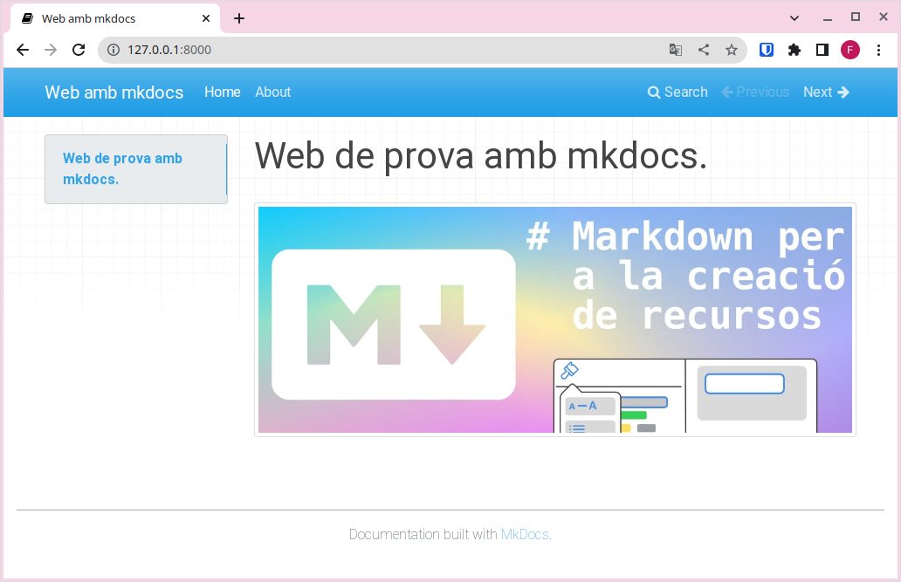
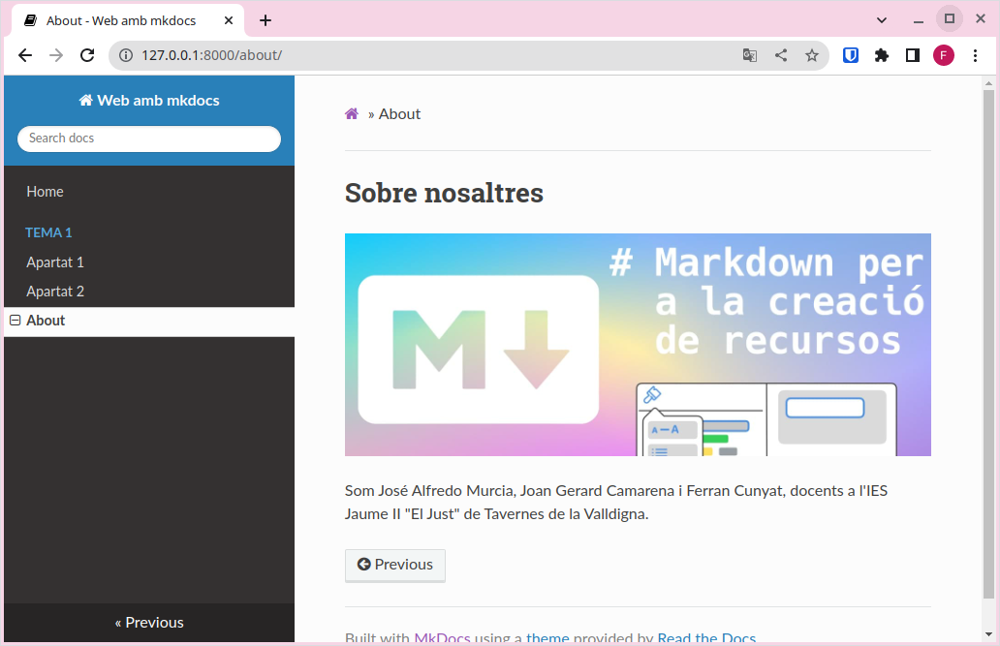
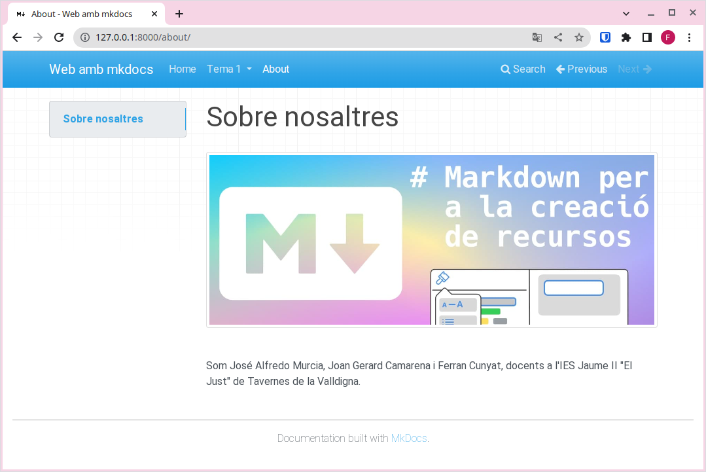
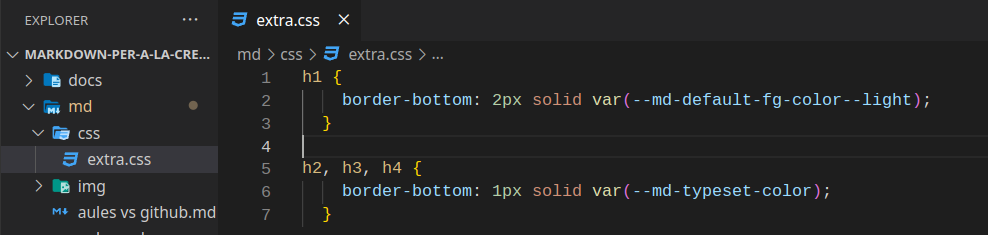
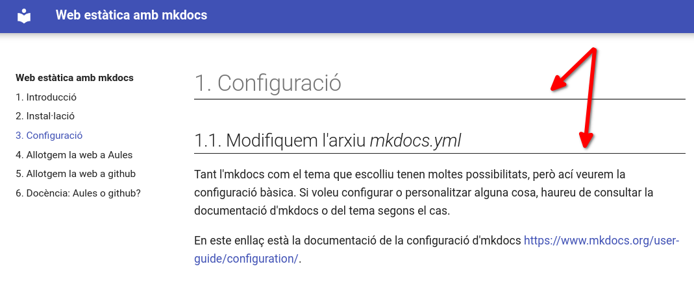
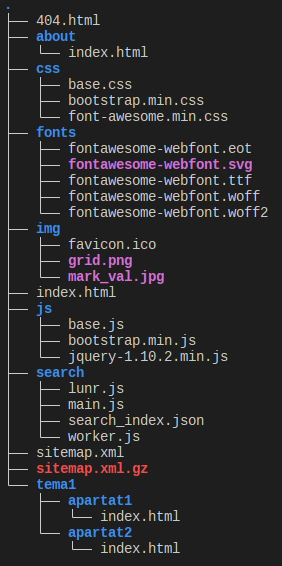

# Configuración

## 1. Modificamos el archivo mkdocs.yml

Tanto MkDocs como el tema que elijas ofrecen muchas opciones de configuración, pero aquí veremos la configuración básica. Si quieres personalizar algo más, tendrás que consultar la documentación de MkDocs o la del tema que estés usando.

Puedes encontrar la documentación sobre la configuración de MkDocs en el siguiente enlace: [https://www.mkdocs.org/user-guide/configuration/](https://www.mkdocs.org/user-guide/configuration/).

### 1.1. site_name

La única configuración estrictamente necesaria para servir la web es site_name, que será una cadena de texto que define el título de la pestaña del navegador y aparecerá en el menú de navegación. Es decir, es el nombre que identifica tu sitio web, así que será la primera configuración que modifiquemos.

Por ejemplo, en el caso de esta web, hemos utilizado site_name: Web estática con MkDocs.

### 1.2. docs_dir

Con la directiva docs_dir, indicamos en qué carpeta se encuentran los archivos fuente (el contenido escrito en Markdown) a partir de los cuales se generará la web.

!!!note "docs_dir"
    De momento podemos dejar docs_dir sin configurar, aunque necesitaremos modificarlo en apartados posteriores.

### 1.3. site_dir

Con la directiva site_dir, indicamos en qué carpeta queremos que se genere la versión compilada de la web lista para publicar.

!!!note "site_dir"
    De momento podemos dejar site_dir sin configurar, pero será necesario en apartados posteriores.

## 2. Páginas

En esta sección veremos cómo configurar nuevas páginas para tu sitio web. Estas serán accesibles a través del menú de navegación.

El primer paso consiste en crear un nuevo archivo con extensión .md (por ejemplo, about.md) y guardarlo en la carpeta docs.

Después, modificaremos el archivo de configuración para añadir al menú de navegación nuestras páginas de la siguiente manera:

```yaml title="YAML" linenums="1"
nav:
    - Home: index.md
    - About: about.md
```
Ahora la página tendrá el siguiente aspecto:

<figure markdown="span">
  
</figure>

Como puedes ver, en el menú de navegación aparecen las opciones Home y About, y también se muestran flechas de Previous y Next para desplazarnos entre páginas.

Para crear submenús en el menú de navegación, podemos configurar el archivo mkdocs.yml así:

```yaml title="YAML" linenums="1"
nav:
    - Home: index.md
    - Tema 1:
      - Apartat 1: tema1/apartat1.md
      - Apartat 2: tema1/apartat2.md
    - About: about.md
```

<figure markdown="span">
  
</figure>

## 3. Buscador

Observa que también disponemos de un buscador en el menú de navegación, que nos permitirá realizar búsquedas en todo el contenido del sitio web.

!!!note "Buscador" 
    Esto puede ser muy útil para tu alumnado, ya que así podrán utilizar tus materiales como documentación de referencia y encontrar de forma rápida el contenido que les interese.

    El motor de búsqueda localizará todas las apariciones de la palabra que se introduzca en el buscador.

## 4. Tema

Hasta ahora, hemos utilizado el tema por defecto para renderizar la página, pero existen otros temas para cambiar su apariencia sin tocar el contenido en Markdown.

Para cambiar de tema, edita el archivo de configuración (mkdocs.yml) y añade una línea como la siguiente:

```yaml title="YAML" linenums="1"
theme: readthedocs
```
Al guardar el archivo, verás que la apariencia del sitio cambia:

<figure markdown>
  
  <figcaption>Tema readthedocs</figcaption>
</figure>

<figure markdown>
  
  <figcaption>Tema mkdocs</figcaption>
</figure>

<figure markdown>
  
  <figcaption>Tema material</figcaption>
</figure>

!!!note "Temas por defecto"
    MkDocs solo incluye de serie dos temas (mkdocs y readthedocs). Sin embargo, existen otros desarrollados por terceros. Por lo general, instalarlos y configurarlos es un proceso muy sencillo, aunque deberás consultar la documentación de cada tema.

    En este enlace encontrarás más información sobre otros temas para MkDocs: [https://github.com/mkdocs/mkdocs/wiki/MkDocs-Themes](https://github.com/mkdocs/mkdocs/wiki/MkDocs-Themes).

!!!note "Material for MkDocs"
    Uno de los temas más completos, amigables y versátiles es Material for MkDocs. Puedes consultar su documentación si quieres usarlo.
    
    Para instalarlo, ejecuta: `pip install mkdocs-material`.

    Para utilizarlo, añade al archivo de configuración: `theme: material`.

    [https://squidfunk.github.io/mkdocs-material/](https://squidfunk.github.io/mkdocs-material/)

### 4.1. Modificamos el tema

Si quieres modificar algunos detalles del tema, puedes crear un archivo con tus propias reglas CSS y colocarlo en la carpeta donde tengas los archivos fuente (la que indiques en docs_dir). Después, en el archivo mkdocs.yml, lo referencias con la opción `extra.css`.

Por ejemplo:

<figure markdown>
  
</figure>

Archivo mkdocs.yml (fragmento):

```yaml title="YAML" linenums="1"
docs_dir: "md"
site_dir: "docs"

...

extra_css:
  - css/extra.css
```

Al construir el proyecto (*build*), comprobarás que los archivos CSS personalizados se copian en la carpeta indicada en *site_dir* y que los cambios se aplican al servir el sitio de manera local.

<figure markdown>
  
</figure>

## 5. Cambiar el icono de la web

Por defecto, MkDocs utiliza su propio icono. Si quieres usar uno diferente, crea un directorio img en la carpeta docs y guarda ahí un archivo llamado favicon.ico. MkDocs lo detectará automáticamente y reemplazará el icono por defecto.

## 6. Añadir admonitions (cajas al estilo “awesomebox”)

Para resaltar contenido con cajas de colores (admonitions), hay que añadir el siguiente plugin en el archivo de configuración:

```yaml title="YAML" linenums="1"
markdown_extensions:
  - admonition
```

A diferencia de “awesomebox”, las cajas de MkDocs se definen con tres signos de exclamación (!!!) y el contenido dentro de la caja va tabulado. Por ejemplo:

```markdown title="Markdown" linenums="1"
!!!note "Anotación"
    Esta parte sí que la podéis probar en casa.

!!!warning "¡Cuidado!"
    Ten cuidado al realizar esta parte.

!!!danger "¡Peligro!"
    No probéis esto en casa.
```

!!!note "Anotación"
    Esta parte sí que la podéis probar en casa.

!!!warning "¡Cuidado!"
    Ten cuidado al realizar esta parte.

!!!danger "¡Peligro!"
    No probéis esto en casa.

## 7. Construir el sitio web

Finalmente, después de haber comprobado en nuestro ordenador que el resultado es el esperado, construimos el sitio web (dejándolo preparado para publicarlo en un servidor) mediante el comando:

```sh title="Bash" linenums="1"
mkdocs build
```

Verás que se crea una carpeta site con la siguiente estructura:

<figure markdown>
  
</figure>

Esta carpeta contiene todos los archivos necesarios para servir el sitio web. Es la carpeta que se debe subir a cualquier servidor para que sea accesible a través de Internet.

## 8. Resum

1. Instalamos MkDocs.
2. Creamos un nuevo proyecto con `mkdocs new "nombre_del_proyecto"`.
3. Servimos el sitio de forma local y comprobamos que todo funciona y se ve como queremos con `mkdocs serve`.
4. Añadimos el contenido en archivos .md en la carpeta docs.
5. Enlazamos los archivos al menú de navegación modificando el archivo mkdocs.yml.
6. Configuramos el tema, el nombre del sitio y el resto de opciones que queramos usar.
7. Construimos el sitio con `mkdocs build`.

De esta manera, dispondremos de un sitio estático listo para ser publicado en cualquier servidor.