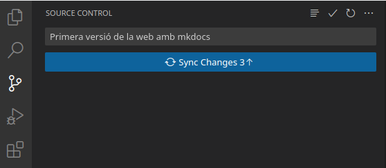

# Alojamiento en GitHub

## 1. Alojamos nuestra web en el servidor de GitHub

### 1.1. ¿Qué es un sistema de control de versiones?

Para entender qué es GitHub, primero debemos conocer dos conceptos relacionados:

- Sistema de control de versiones
- Git

Un *sistema de control de versiones* ayuda a los desarrolladores (o creadores de contenido) a rastrear y gestionar los cambios que se van produciendo en un proyecto. Se utiliza de forma muy habitual en el desarrollo de software, pero también puede aplicarse a otros ámbitos, como el educativo, para gestionar nuestros apuntes de forma organizada.

Veamos un ejemplo:

Imagina que somos desarrolladores colaborando en [WordPress](https://wordpress.com/es/). Si uno de estos desarrolladores quisiera trabajar en una parte concreta del código de WordPress, no sería seguro ni eficiente editar el código “oficial” directamente.

En su lugar, el control de versiones permite a los programadores trabajar con seguridad a través de *ramificaciones* y *fusiones*:

- **Ramificación**: un desarrollador duplica el código fuente (llamado repositorio) en su equipo local y puede modificar solo esa parte, sin afectar al resto del proyecto.
- **Fusión**: cuando el desarrollador ha probado y confirmado que sus cambios funcionan correctamente, integra (fusiona) su parte del código con la rama principal, haciendo oficiales las modificaciones.

El *sistema de control* de versiones nos permite, entre otras cosas, ver qué cambios se han hecho, revertirlos, fusionarlos o incluso volver a versiones anteriores del proyecto.

Otro ejemplo muy claro de control de versiones lo vemos en Google Docs. Para acceder a las distintas versiones de un documento, basta con hacer clic en el indicador que muestra la última fecha de modificación. En la ventana que aparece, podemos ver todas las revisiones guardadas, observar en verde lo que se ha añadido o cambiado y, si lo deseamos, revertir el documento a un estado anterior.


Además de la vista con todas las versiones, también podemos ver en verde el contenido nuevo y, en ocasiones, con texto tachado las partes que se han eliminado.


VSCode también ofrece un sistema básico de control de versiones para nuestros archivos: permite volver a un punto anterior en el tiempo. Para usarlo, haz clic en la parte inferior derecha, en *TIMELINE* o *LÍNEA DE TIEMPO* (según el idioma), donde verás las diferentes versiones que se han guardado de forma automática. Al pulsar sobre cualquier versión, el editor te mostrará los cambios realizados respecto a la actual y te dará la opción de recuperar la versión anterior si así lo prefieres.

<figure markdown="span">
  
</figure>

#### 1.1.1. Git

Git es un sistema de control de versiones de código abierto creado por Linus Torvalds (el desarrollador inicial del kernel de Linux) en 2005.

Se considera un sistema de control de versiones distribuido, ya que todas las versiones del proyecto están disponibles en el ordenador de cada desarrollador, lo que facilita enormemente la creación de ramas y la fusión de código.

De acuerdo con encuestas de Stack Overflow, más del 87% de los desarrolladores utilizan Git, lo que lo convierte en la herramienta más popular para el control de versiones en la actualidad.

### 1.2. Entonces, ¿qué es [GitHub](https://github.com/)?

GitHub es una plataforma que ofrece alojamiento gratuito de repositorios Git en la nube. Dicho de otro modo, permite utilizar repositorios Git a través de la web sin necesidad de trabajar siempre con la línea de comandos.

Su interfaz es muy sencilla e intuitiva, lo que ha hecho que GitHub sea muy popular no solo para desarrollar software, sino también para gestionar todo tipo de proyectos (libros, apuntes, documentación, etc.).

Al crear repositorios en GitHub, puedes decidir si serán públicos —accesibles para cualquiera— o privados, en cuyo caso solo los colaboradores designados podrán acceder a ellos.

!!!note "Acerca de GitHub"
    GitHub se lanzó en 2008. 

    En 2018, Microsoft adquirió GitHub por 7.500 millones de dólares.

    En enero de 2020, GitHub contaba con más de 40 millones de usuarios, más de 190 millones de repositorios y 28 millones de repositorios públicos.


## 2. Configuración de GitHub

### 2.1. Registro de usuario

En este primer apartado crearemos un repositorio en GitHub para alojar nuestra página web. 

El primer paso consiste en registrarnos en GitHub (si aún no tenemos cuenta), accediendo al siguiente enlace: [https://github.com/signup](https://github.com/signup?user_email=&source=form-home-signup).

!!!warning "Registro"
    Observa que el proceso de registro se realiza mediante un formulario totalmente integrado en la web, con una estética muy cuidada.

<figure markdown="span">
  
</figure>

### 2.2. Creación de un repositorio

Un repositorio de GitHub es un proyecto alojado en la nube sobre el que queremos llevar un control de versiones a través de la web.

!!!warning "Repositorio local de GitHub"
    También podemos clonar un repositorio en nuestro disco duro para trabajar de forma local y subir solo los cambios definitivos para su publicación.

    Visual Studio Code (VSCode) facilita mucho este proceso de trabajo con repositorios de GitHub. Recomendamos encarecidamente esta forma de proceder.

Para crear un repositorio, iniciamos sesión en [https://github.com](https://github.com). Luego, en la parte superior derecha, pulsamos el botón con el símbolo `+` y elegimos la opción `New repository`. 

<figure markdown="span">
  
</figure>

Asignamos un nombre que identifique el repositorio y lo marcamos como público (o privado, si así lo deseamos). Opcionalmente, podemos añadir un fichero `README` y una licencia.

<figure markdown="span">
  
</figure>

### 2.3. Clonación del repositorio

A continuación, vamos a descargar el repositorio de GitHub a nuestro ordenador para poder agregarle contenido. Una vez comprobado que todo funciona, volveremos a subir esos cambios a GitHub para que se publique la web.

Para obtener el código y trabajar en él, es necesario clonar el repositorio en nuestro disco duro. Utilizaremos la pestaña de control de versiones integrada en Visual Studio Code para hacerlo:

<figure markdown="span">
  
</figure>

VSCode nos pedirá la URL del repositorio que queremos clonar. Podemos obtenerla desde GitHub de dos maneras distintas, dependiendo de si el repositorio está completamente vacío o si ya contiene algún archivo (por ejemplo, README.md y LICENSE).

<figure markdown="span">
  
  <figcaption>VSCode Clonar Repositorio vacío</figcaption>
</figure>

<figure markdown="span">
  
  <figcaption>VSCode Clonar Repositorio no vacío</figcaption>
</figure>

!!!important "Git"
    Si no tienes Git instalado, la opción para clonar el repositorio aparecerá deshabilitada. 

En sistemas basados en Debian/Ubuntu se puede instalar con:

```sh title="Bash" linenums="1"
sudo apt install git
```

En Windows, puedes visitar este enlace para descargar la última versión [enlace](https://github.com/git-for-windows/git/releases/) (por ejemplo, Git-2.39.2-64-bit.exe en el momento de redactar estos apuntes).

Si todo se clona correctamente, verás que se ha creado una carpeta con el mismo nombre del repositorio en la ubicación elegida. En caso de que el repositorio contenga archivos, los encontrarás dentro de esa carpeta.

### 2.4. Configuramos el proyecto de mkdocs para publicar en GitHub

Ahora debemos crear un proyecto de mkdocs dentro de la carpeta del repositorio o, si lo preferimos, copiar un proyecto de mkdocs que hayamos creado previamente dentro de la carpeta clonada de GitHub.

!!!warning "mkdocs new"
    Cuando creamos un proyecto mkdocs desde cero, usamos el comando `mkdocs new "nombre_del_proyecto"`. 
    
    Sin embargo, si ya tenemos una carpeta del repositorio clonado en GitHub, deberemos ejecutar `mkdocs new "nombre_carpeta_github"`.
    
    De este modo, mkdocs usará directamente esa carpeta (en lugar de crear una carpeta anidada dentro de la otra).

!!!important "Carpeta docs y site"

    Por defecto, los archivos Markdown en un proyecto mkdocs se encuentran en la carpeta `docs`, mientras que el sitio web generado se construye en la carpeta `site`. Sin embargo, GitHub Pages solo puede publicar una web desde la raíz del repositorio o desde la carpeta docs.    

    Por tanto, tenemos dos opciones:

    1. Ejecutar `mkdocs build` y copiar el contenido de la carpeta `site` a la raíz del repositorio (opción no recomendada).
    2. Ajustar la configuración para que los archivos fuente en Markdown estén en otra carpeta y el resultado de la compilación se genere en `docs` (opción recomendada). 

    Con la **segunda opción recomendada** podemos conservar tanto los archivos fuente en Markdown como la web compilada en un mismo repositorio de GitHub.

Para configurar esta segunda opción, debemos modificar el archivo de configuración de mkdocs e indicar lo siguiente:

```yaml title="YAML" linenums="1"
docs_dir: 'md'
site_dir: 'docs'
```

Así, los archivos Markdown se ubican en una carpeta llamada md, mientras que el resultado de la construcción (build) se deposita en la carpeta docs.

Cuando ejecutemos el comando `mkdocs build`, los archivos finales de la web se generarán automáticamente en la carpeta docs.

### 2.5. Agregamos los archivos locales al repositorio remoto de GitHub

Ahora debemos publicar los cambios que acabamos de realizar en nuestra copia local del repositorio para que aparezcan en GitHub.

Fíjate en que en el explorador de archivos de VSCode, a la izquierda de cada archivo, puede aparecer la letra U (*untracked*, es decir, no incluido todavía en el repositorio) o M (*modified*, modificado después de un commit previo).

Para subir estos archivos, iremos a la pestaña *Source Control* (Control de código fuente) en el lado izquierdo de VSCode. Allí, escribimos un mensaje indicando los cambios que hemos realizado y pulsamos el botón Commit. Por ejemplo, podríamos escribir algo como: “Primera versión de la web con mkdocs”.

<figure markdown="span">
  
</figure>

VSCode mostrará una ventana preguntando si queremos añadir y confirmar todos los cambios a la vez. Aceptamos para continuar.

Para evitar si se produce algún error de configuración de Git, es probable que tengamos que indicar nuestro nombre y correo mediante los siguientes comandos (con los datos que utilizamos en el registro de GitHub):

```sh title="Bash" linenums="1"
git config --global user.email "Tu correo electrónico"
git config --global user.name "Tu nombre de usuario"
```

### 2.6. Subimos los cambios a GitHub

Una vez hechos los commits en el repositorio local, solo nos queda sincronizar los cambios con el repositorio remoto.

Para ello, pulsamos en el botón de sincronización (que aparece donde antes veíamos el de `commit`, dentro de la pestaña de control de versiones).

<figure markdown="span">
  
</figure>

VSCode solicitará permiso para que la extensión de GitHub (que viene integrada por defecto) inicie sesión y pueda guardar los cambios en el repositorio remoto. Debemos concederle permiso; esto iniciará un intercambio de tokens entre el navegador y VSCode para asegurar la autenticación. Si no habíamos iniciado sesión en GitHub, nos pedirá usuario y contraseña.

<figure markdown="span">
  
</figure>

Si todo ha ido bien, en la parte de cuentas de usuario (icono situado abajo a la izquierda en VSCode) aparecerá nuestra sesión de GitHub iniciada y el repositorio local quedará sincronizado con el remoto.

<figure markdown="span">
  
</figure>

Podemos verificar que nuestros archivos se han subido correctamente accediendo a GitHub y comprobando que, en la página del repositorio, aparecen los nuevos ficheros.

<figure markdown="span">
  
</figure>

## 3. Configuramos GitHub para que publique la web

Por último, solo queda ajustar la configuración en GitHub para que publique nuestro *build*.

Accede a la pestaña *Settings* del repositorio y busca la sección **Pages**. Selecciona la rama principal (normalmente *main*) y la carpeta *docs* como ubicación de la web.

Después de unos instantes (la primera vez puede tardar 5 minutos), GitHub indicará si la página se ha publicado o si ha habido algún problema. Si todo está correcto, verás la dirección donde se ha publicado la web, normalmente con el formato **https://nombre_usuario.github.io/nombre_repositorio**. Puedes probar a navegar a esa dirección para ver si tu página se muestra tal y como aparecía en el servidor local.

!!!warning "Trabajo local y trabajo remoto"
    Los archivos pueden modificarse tanto desde la web de GitHub como desde tu entorno local. Sin embargo, para proyectos basados en mkdocs, suele ser necesario compilar la web (build) antes de que los cambios se vean reflejados. Por ello, es aconsejable trabajar en local para poder generar el sitio, y luego subir (push) los cambios.

!!!warning "Construcción de la web"
    Recuerda ejecutar el comando `mkdocs build` antes de subir los cambios, de lo contrario solo se actualizarán los archivos fuente y no la web generada. Por lo general, GitHub Pages tarda un par de minutos en reflejar los cambios después de sincronizar con el repositorio remoto.

!!!note "Uso de Source Control"
    Si estás acostumbrado a trabajar con Git y GitHub desde línea de comandos, puedes usar directamente `git clone`, `git add`, `git commit` y `git push`. Visual Studio Code actúa como una interfaz gráfica que simplifica el proceso, pero el funcionamiento interno es el mismo. 

## 4. Mi archivo completo mkdocs.yml

Os dejo como tengo configurado mi archivo mkdocs.yml de la web del Proyecto intermodular

```yaml title="YAML" linenums="1"
# Nom del lloc
site_name: PROYECTO INTERMODULAR

# Carpeta amb el documents font
docs_dir: 'md'

# Carpeta on es generarà el lloc web (mkdocs build)
site_dir: 'docs'

# Adreça on s'executa el server local (mkdocs serve)
dev_addr: localhost:4000

# Navegació dels documents
nav:
- Inicio: index.md
- Markdown:
  - Introducción: markdown/introduccion.md
  - Editores: markdown/editores.md
  - Sintaxis básica: markdown/sintaxis.md
  - Referencias: markdown/referencias.md
- MkDocs:
  - Introducción: mkdocs/introduccion.md
  - Instalación: mkdocs/instalacion.md
  - Configuración: mkdocs/configuracion.md
  - Alojamiento en GitHub: mkdocs/github.md
  - Referencias: mkdocs/referencias.md

# Extenions
markdown_extensions:
  - admonition
  - attr_list
  - md_in_html
  - pymdownx.highlight:
      anchor_linenums: true
      line_spans: __span
      pygments_lang_class: true
  - pymdownx.inlinehilite
  - pymdownx.snippets
  - pymdownx.superfences

# Tema a triar
theme: 
  name: material   # selecció del tema - mkdocs o readthedocs / material (pip install mkdocs-material)
  highlightjs: true
  palette:
   # Boto que canvia a mode oscur
    - scheme: default
      toggle:
        icon: material/brightness-7 
        name: Switch to dark mode
    # Botó que canvia a mode clar
    - scheme: slate
      toggle:
        icon: material/brightness-4
        name: Switch to light mode
  features:
    # utilitats de copia de codi
    - content.code.copy 
    - content.code.select
    - content.code.annotate
    - navigation.top    # boto flotant de tornar a dalt 

extra_css:
  - css/extra.css

# Altres afegits
plugins:
  - search      # plugin del quadre cerca
```

