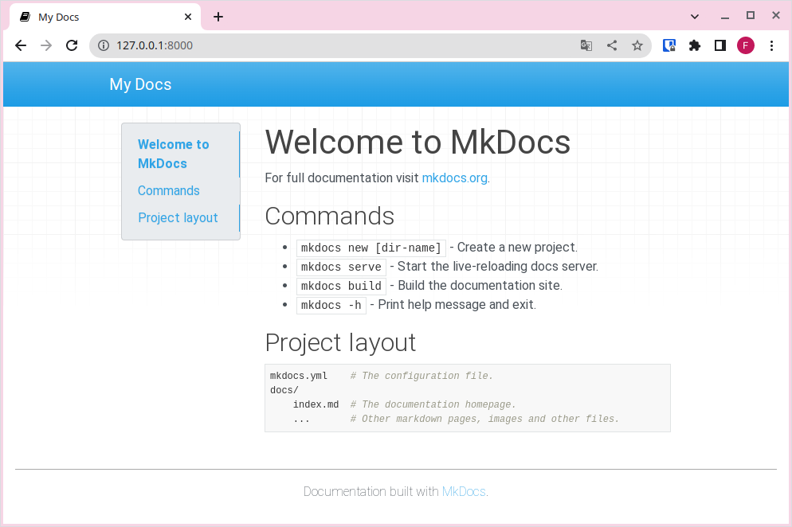

# Instalación MkDocs

Para seguir estos pasos, recomendamos utilizar **Visual Studio Code (VSCode)**, ya que permite disponer de un editor de archivos y una terminal integrada en el mismo programa.

## 1. Instalación de MkDocs

Para instalar **MkDocs** en nuestro ordenador, ejecutaremos el siguiente comando en la consola (Konsole para LliureX, PowerShell para Windows...):

```sh title="Bash" linenums="1"
pip install mkdocs
```

!!!warning "Pip"
    Si no tienes instaldo pip, tendrás que instalar Python3 y, durante la instalación, marcar la opción de instalar pip y añadirlo al PATH. Puedes descargar Python3 en el siguiente enlace [https://www.python.org/downloads/](https://www.python.org/downloads/).

Una vez que MkDocs esté instalado, deberías poder ejecutar el siguiente comando en la consola:

```sh title="Bash" linenums="1"
mkdocs --version
```

Si todo va bien, obtendrás una respuesta similar a la siguiente:

```sh title="Bash" linenums="1"
Linux:
 - mkdocs, version 1.6.1 from /home/usuario/.local/lib/python3.13/site-packages/mkdocs (Python 3.13)

Windows:
 - mkdocs, version 1.6.1 from C:\Users\Usuario\AppData\Local\Programs\Python\Python313\Lib\site-packages\mkdocs (Python 3.13)
```

## 2. Creación de un nuevo proyecto

Ahora que MkDocs está instalado, necesitamos crear un nuevo proyecto para construir nuestro sitio web. Para ello, ejecutamos:

```sh title="Bash" linenums="1"
mkdocs new "nombre_del_proyecto"
```

## 3. Estructura del proyecto

Al crear un nuevo proyecto con MkDocs, verás que se ha generado una estructura parecida a esta:

```title="Text only"
.
├── docs
│   └── index.md
└── mkdocs.yml
```

- El archivo **mkdocs.yml** es el archivo de configuración principal de todo el proyecto.
- La carpeta **docs** contendrá los documentos en formato Markdown.
- El archivo **index.md** es un archivo de muestra que se mostrará al acceder a la raíz del sitio web.

Como puedes observar, por un lado tendrás el contenido en formato Markdown y, por otro, la configuración de cómo se va a renderizar este contenido.

!!!warning "Carpeta docs"
    Aunque, por defecto, los archivos Markdown se encuentren en la carpeta docs, más adelante modificaremos esta configuración.

## 4. Servir la web en local

Para servir una web, normalmente necesitaríamos un servidor que hospede nuestro sitio y que nos permita acceder a él de forma local o remota a través del navegador. MkDocs nos facilita esta tarea creando un servidor en nuestro propio equipo para que podamos previsualizar los cambios antes de publicarlos en un servidor público (accesible desde Internet) o de compilar el sitio para su publicación.

Para servir la web, simplemente ejecuta el siguiente comando dentro de la carpeta del proyecto (usa el comando cd para entrar en ella):

```sh title="Bash" linenums="1"
$ mkdocs serve
INFO     -  Building documentation...
INFO     -  Cleaning site directory
INFO     -  Documentation built in 0.06 seconds
INFO     -  [12:49:32] Watching paths for changes: 'docs', 'mkdocs.yml'
INFO     -  [12:49:32] Serving on http://127.0.0.1:8000/
```

A continuación, accede a la URL http://127.0.0.1:8000/ y verás la página web por defecto:

<figure markdown="span">
  
</figure>

!!!note "Índice por defecto"
    Abre en VSCode el archivo index.md y comprueba cómo se corresponde con lo que ves en tu navegador. Es decir, MkDocs está convirtiendo el contenido Markdown a un formato web.

    Ahora puedes introducir los cambios que desees en tu contenido; al guardar, los cambios se reflejarán automáticamente en el navegador, siempre y cuando el comando `mkdocs serve` siga en ejecución. **La recarga automática se produce siempre que modifiques el archivo de configuración, los archivos Markdown o cualquier archivo del tema que estés usando.**
